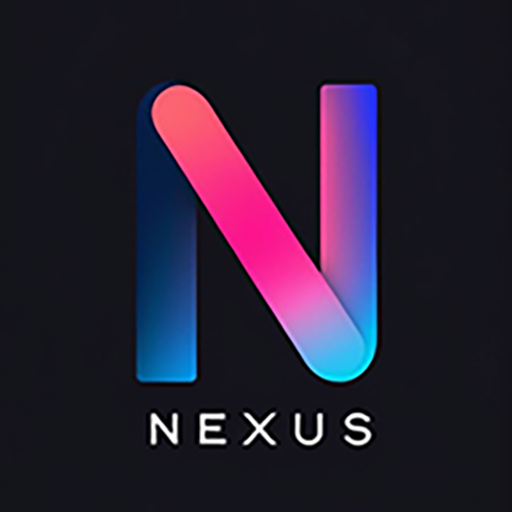

# SocialNexus — One-Page Pitch

---

## What Is It?

**SocialNexus** is a production-ready SaaS platform for automating Telegram and Discord from a single web dashboard. Live at [socialnexus.us](https://socialnexus.us).

---

## By the Numbers

| | |
|---|---|
| **314,112** lines of code | **463** source files |
| **461** API endpoints | **26** database models |
| **18** Telegram tools | **5** Discord tools |
| **51** backend services | **143** React components |
| **5** subscription tiers | **30-day** free trial |

---

## Revenue Model (Built-In)

| Tier | Price | Target |
|------|-------|--------|
| Free Trial | $0 / 30 days | Full Tier 3 access |
| Starter | $5/month | Solo entrepreneurs |
| Pro | $10/month | Growing teams |
| Scale | $15/month | Scaling marketers |
| Lifetime | $350 one-time | Power users |
| Self-serve | $10/yr or $50 lifetime | SellAuth checkout |

---

## Top Features

1. **Bulk Channel Joiner v2** — Multi-account parallel joining (5,497 lines)
2. **Mass DM Campaigns** — Full campaign management with templates
3. **Account Health Dashboard** — Proactive ban/flood prevention
4. **2,000+ Channel Marketplace** — Pre-vetted channel library
5. **AddLink Creator** — Telegram folder/chatlist automation
6. **Keyword Searcher** — Competitor/niche channel discovery
7. **Media Copier** — Cross-channel content replication
8. **Admin Control Plane** — Full user/key/marketplace management

---

## Tech Stack

**Backend:** Node.js, Express, GramJS, MongoDB, Redis (optional)  
**Frontend:** React 19, Tailwind CSS, MUI, Framer Motion  
**Deploy:** PM2, optional Redis, MongoDB required

---

## What Makes It Valuable

- **Turnkey monetization** — tiers, trial, checkout all implemented
- **Enterprise reliability** — task restoration, flood protection, memory guard
- **Massive feature depth** — 12-18 months to rebuild from scratch
- **Marketing ready** — landing page, POC page, SEO, trial popup built
- **Admin dashboard** — operate the business without touching code
- **Redis + in-memory** — works with or without Redis

---

## Included in Sale

- Full source code (backend + frontend)
- 26 MongoDB schemas with data models
- Admin dashboard with 71 API endpoints
- Landing page + POC investor page
- SellAuth payment integration
- Trial system with anti-fraud
- This sales documentation package

---

## Live Demo Pages

| URL | What It Shows |
|-----|---------------|
| [socialnexus.us](https://socialnexus.us) | Landing page + pricing |
| [socialnexus.us/poc](https://socialnexus.us/poc) | Investor documentation |
| [socialnexus.us/login](https://socialnexus.us/login) | License key auth |

---

*Full documentation in this `/sell` folder. Start with [README.md](./README.md).*
